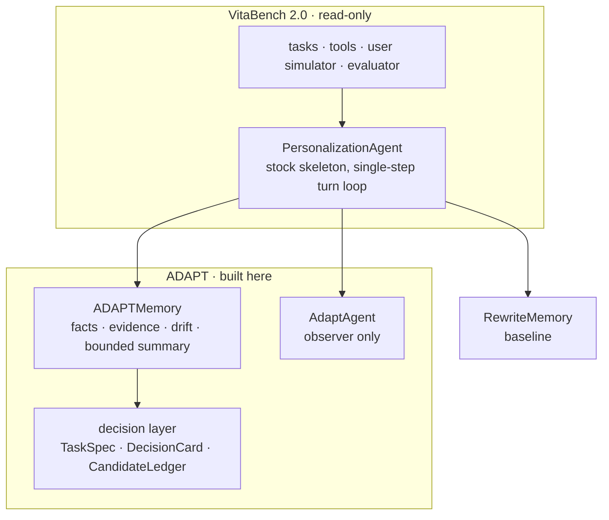

# ADAPT

**A**gent with **D**ynamic **A**daptive **P**references **T**oward Sustained Consumption Goals

[](https://github.com/meituan-longcat/VitaBench-2.0)
[](LICENSE)

ADAPT is a long-horizon consumer agent for personalization: it remembers a user's
preferences across sessions, updates them when they change, and uses them to pick
and book real items — food delivery, in-store vouchers, hotels, flights, trains —
over long multi-subtask interactions. It runs as a **data layer on top of the
pristine VitaBench 2.0 skeleton**, evaluated head-to-head against the benchmark's
own `Agentic Memory` backend.

> **At a glance — same backbone (Qwen3.8-27B, no thinking), same memory backend,
> same trials, same evaluator: only the agent differs.**
>
> **Avg@4 0.293 → 0.364 (+24.2%)** · `Pass@4` 0.600 → 0.632 (+5.3%) ·
> `Pass^4` 0.200 → 0.212 (+6.0%)
>
> Injected memory **2,951 → 934 characters (−68%)**, carrying **≈4,000** structured
> preference slots · ungrounded tool ids **≈33 → 0** · abandoned orders
> **11.8% → 9.1%**

*The two `≈` figures are proportional extrapolations to this cohort's 819 subtasks
from a per-block audit on a 100-subtask sample (×8.19), not measurements taken on
the full cohort; per-block sizes and rates above are measured directly.*

---

## Results

All rows share one protocol: memory = `rewrite`, 4 trials per person, evaluation
unit = `(person, subtask)`, identical user simulator and evaluator.

<table>
  <thead>
    <tr>
      <th align="left">Agents</th>
      <th align="left">Backbone</th>
      <th align="right">Params</th>
      <th align="center">Avg@4</th>
      <th align="center">Pass@4</th>
      <th align="center">Pass^4</th>
      <th align="center">People / Subtasks</th>
    </tr>
  </thead>
  <tbody>
    <tr>
      <td colspan="7" align="center"><em><strong>Non-thinking Models</strong></em></td>
    </tr>
    <tr>
      <td>baseline agent (rewrite)</td>
      <td>Qwen3.8-27B (w/o thinking)</td>
      <td align="right">27B</td>
      <td align="center">0.293</td>
      <td align="center">0.600</td>
      <td align="center">0.200</td>
      <td align="center">56 / 819</td>
    </tr>
    <tr>
      <td>baseline agent (rewrite)</td>
      <td>GLM-4.6 (w/o thinking)</td>
      <td align="right">355B-A32B</td>
      <td align="center">0.336</td>
      <td align="center">0.623</td>
      <td align="center">0.084</td>
      <td align="center">56 / 819</td>
    </tr>
    <tr>
      <td>baseline agent (rewrite)</td>
      <td>Kimi-K2.6 (w/o thinking)</td>
      <td align="right">1T-A32B</td>
      <td align="center">0.397</td>
      <td align="center"><strong>0.674</strong></td>
      <td align="center">0.145</td>
      <td align="center">56 / 819</td>
    </tr>
    <tr>
      <td>baseline agent (rewrite)</td>
      <td>DeepSeek-V4-Pro (w/o thinking)</td>
      <td align="right">1.6T-A49B</td>
      <td align="center"><strong>0.456</strong></td>
      <td align="center">0.652</td>
      <td align="center"><strong>0.267</strong></td>
      <td align="center">56 / 819</td>
    </tr>
    <tr>
      <td colspan="7" align="center"><em><strong>Thinking Models</strong></em></td>
    </tr>
    <tr>
      <td>baseline agent (rewrite)</td>
      <td>Gemini-2.5-Flash (w/ thinking)</td>
      <td align="right">Unknown</td>
      <td align="center">0.312</td>
      <td align="center">0.567</td>
      <td align="center">0.098</td>
      <td align="center">56 / 819</td>
    </tr>
    <tr>
      <td>baseline agent (rewrite)</td>
      <td>Qwen3-Max (w/ thinking)</td>
      <td align="right">&gt;1T</td>
      <td align="center">0.324</td>
      <td align="center">0.599</td>
      <td align="center">0.091</td>
      <td align="center">56 / 819</td>
    </tr>
    <tr>
      <td>baseline agent (rewrite)</td>
      <td>GLM-5.1 (w/ thinking)</td>
      <td align="right">744B-A40B</td>
      <td align="center">0.352</td>
      <td align="center">0.556</td>
      <td align="center">0.150</td>
      <td align="center">56 / 819</td>
    </tr>
    <tr>
      <td>baseline agent (rewrite)</td>
      <td>Claude-Opus-4.6 (w/ thinking)</td>
      <td align="right">Unknown</td>
      <td align="center"><strong>0.454</strong></td>
      <td align="center"><strong>0.645</strong></td>
      <td align="center"><strong>0.259</strong></td>
      <td align="center">56 / 819</td>
    </tr>
    <tr>
      <td><strong>ADAPT</strong></td>
      <td><strong>Qwen3.8-27B (w/o thinking)</strong></td>
      <td align="right"><strong>27B</strong></td>
      <td align="center"><strong>0.364</strong></td>
      <td align="center"><strong>0.632</strong></td>
      <td align="center"><strong>0.212</strong></td>
      <td align="center"><strong>56 / 819</strong></td>
    </tr>
  </tbody>
</table>

**Bold** marks the best value in a column; the ADAPT row is bold to mark it as
ours, so within `Avg@4`, `Pass@4` and `Pass^4` the best baseline value is what is
bolded.

**vs the same-backbone baseline (0.293 / 0.600 / 0.200): Avg@4 +0.071 (+24.2%) · Pass@4 +0.032 (+5.3%) · Pass^4 +0.012 (+6.0%)**

**Why `rewrite`.** The evaluation hardware is **8 × NVIDIA RTX 4090**, so a heavier
memory backend would let the injected context grow until VRAM bounds it rather than
the method — a gap that would look like a result without being one. `rewrite`, the
benchmark's own `Agentic Memory` backend, keeps the context budget comparable
across every row, so what the table compares is the agent, not the memory
footprint.

### Metric definitions

All three are computed per official evaluation unit — one `(person, subtask)`
pair observed across `k` trials — and then averaged over units. A subtask counts
as successful only when its reward is exactly `1.0`.

| Metric | Definition | Reads as |
|---|---|---|
| **Avg@k** | mean of each unit's `k`-trial success rate | "how often does it get this right" |
| **Pass@k** | fraction of units successful **at least once** in `k` trials | "can it ever solve this" |
| **Pass^k** | fraction of units successful **in every one** of `k` trials | "does it solve this reliably" |

`Avg@1 = Pass@1 = Pass^1` by definition, so a single-trial run reports one number,
not three. `Pass@k` and `Pass^k` only separate for `k ≥ 2`; the gap between them
(`Pass@4 = 0.600` vs `Pass^4 = 0.200` for the Qwen baseline) is the **reliability
gap** — solvable by luck far more often than solvable on demand.

---

## Innovations

- **Structured, polarity-typed preferences instead of prose.** Facts are scoped by
  `(scope, facet, dimension, category)` and carry the evidence they came from.
  Single-valued dimensions supersede an older value; genuinely multi-valued ones —
  avoids, allergies, brands — accumulate instead. Typed polarity means a dislike
  can never be rendered as a preference, and both read paths share one renderer.
- **A priority-bounded Decision Card.** Budgeting is by priority, not position:
  `MUST` and `AVOID` are the conditions the current instruction is graded on, so
  they always render in full and the fact budget bounds only the soft sections. A
  constraint cut at render time was never seen by the model, so no positional cut
  is allowed to drop one.
- **Recall that stays bounded, and much smaller.** One LLM-maintained profile
  summary of at most `summary_max_chars` characters is the recall half of the data
  layer. The injected block lands at **934 characters against the baseline's 2,951
  (−68%)**, while **92%** of blocks carry a machine-usable `PREFER` slot list
  (**≈4,000 entries** at this cohort's size) and **38%** a typed `AVOID` slot — the
  baseline's memory has neither structure.
- **An observer-only controller.** The agent may only pass through observed values,
  withhold an irreversible action, or hand the question back to the user. It never
  invents a value, never decides for the user or the model, never reorders or
  preempts the model's message, and never blocks a tool call. With every switch off
  it is a byte-identical pass-through of the stock skeleton, asserted by a test.
- **Grounded writes and finished transactions.** Only ids parsed out of tool output
  the model has actually seen are offered for a write, and the payment step stays
  explicit: ordered-id grounding **0.9828 → 1.0000** (ungrounded ids **≈33 → 0** at
  this cohort's size), created-but-never-paid **11.8% → 9.1%** (−23% relative).

---

## How it works



**What is whose.** The benchmark defines the task; the work here is the memory data
layer, the decision layer and the agent. The only per-turn injection point the
agent gets is a single `generate_next_message`.

| Provided by VitaBench 2.0 — read-only, unmodified | Built in this repository |
|---|---|
| task scripts, tool environment, user simulator, evaluator, official metric | scoped fact store, signal evidence, drift, proactive-question proposal, bounded profile summary |
| the stock `PersonalizationAgent` turn loop and its `RewriteMemory` backend | the decision layer (`TaskSpec`, `DecisionCard`, `CandidateLedger`) and `AdaptAgent` |
| every `baseline agent (rewrite)` row of the table above | the ADAPT row, and every measurement device used to judge it |

`AdaptAgent` is an **observer**: it carries state and may annotate a copy of the
turn, but it never modifies, replaces, reorders or preempts the model's message,
and never blocks a tool call or a write. With every switch off it is a verified
byte-for-byte pass-through of the stock skeleton.

The data layer hands the model **directly usable, dimension-scoped conclusions
with their evidence**. It does not rank for the model, hide tools, auto-ask, or
auto-terminate. At runtime nothing reads rewards, rubrics, target ids or
target/distraction annotations.

---

## Quick start

Python ≥ 3.11, Git ≥ 2.40, and pip or uv. No Docker: the VitaBench tools are a
simulated environment that runs in-process.

```bash
# 1. the benchmark, as a read-only dependency
cd evaluation/vitabench && pip install -e . && cd ../..

# 2. the dataset
pip install -U "huggingface_hub[cli]"
huggingface-cli download meituan-longcat/VitaBench-2.0 \
  --repo-type dataset --local-dir data/vita/domains/personalization

# 3. verify the checkout: agent tests, a compile check,
#    and that the vendored benchmark has no diff
./scripts/test_agent.ps1
```

`models_adapt.yaml` and `memory_adapt.yaml` are **ASCII-only overlays** and must be
exported before any run — VitaBench opens its own YAML without an encoding, so on
Windows the overlay is the supported route:

```powershell
$env:VITA_MODEL_CONFIG_PATH  = (Resolve-Path models_adapt.yaml).Path
$env:VITA_MEMORY_CONFIG_PATH = (Resolve-Path memory_adapt.yaml).Path
```

The overlay points at any OpenAI-compatible endpoint; the table above was produced
with three local servers and `enable_thinking: false`.

---

## Reproduce the table

Baseline and ADAPT differ by **one flag** (`--agent`); memory backend, backbone,
trial count and evaluator are held identical.

```powershell
# baseline: pristine skeleton + the benchmark's own Agentic Memory backend
python -m agent.vitabench_runner `
  --agent stock --cohort all --num-trials 4 --memory-type rewrite `
  --agent-llm qwen38-agent --user-llm qwen35-user --evaluator-llm qwen36-evaluator `
  --save-to data/simulations/baseline_rewrite.json

# ADAPT: same everything, agent swapped
python -m agent.vitabench_runner `
  --agent adapt --cohort all --num-trials 4 --memory-type rewrite `
  --agent-llm qwen38-agent --user-llm qwen35-user --evaluator-llm qwen36-evaluator `
  --save-to data/simulations/adapt_rewrite.json
```

Swap the `--agent-llm` / `--user-llm` / `--evaluator-llm` keys to reproduce the
other backbone rows. Every checkpoint records its own `info` block — backbone,
memory backend, trial count, feature switches and source fingerprints — so the
exact configuration of any published number is recoverable from the artifact
itself, and resuming with changed runtime sources is rejected.

Score a checkpoint into the three metric families (zero model calls):

```powershell
python scripts/_official_metrics.py data/simulations/adapt_rewrite.json
```

### Measurement devices

```powershell
# paired, unit-level contrast: direction counts + sign test on official units
python scripts/paired_arms.py baseline.json adapt.json --label baseline --label adapt

# graded diagnosis: per-condition hits and missed dimensions
python scripts/rubric_breakdown.py data/simulations/adapt_rewrite.json --per-subtask

# re-score saved trajectories without replaying the agent
python -m agent.reevaluate_guarded --checkpoint run.json --output run_detail.json `
  --all --evaluator-llm qwen36-evaluator --normalize-extracter
```

---

## Measurement methodology

Three rules in this repository are load-bearing, and each one was adopted after it
caught a real error:

1. **The unit is `(person, subtask)`, not `(person, trial, subtask)`.** Trials are
   replicates of one script. Treating them as independent multiplies N by the trial
   count and inflates every significance claim.
2. **A delta below the cohort's resolution floor is reported as "not resolvable",
   never as "no effect".** The floor is the between-person component
   (`2·SE ≈ ±0.058` on a small dev cohort), and it does **not** shrink by adding
   trials — a change whose expected effect is smaller than the floor is not worth
   building on a cohort that size.
3. **A cohort is identified by the checkpoint's `tasks` field, not by a CLI label.**
   The same label has already named two different user sets in this repository, so
   `scripts/paired_arms.py` refuses to compare checkpoints whose `tasks` differ.

Mechanisms are instrumented for the same reason: each one exposes its own counters
(questions committed, answers linked, answers resolved into a slot value) and every
score claim is gated by a paired unit-level test fixed **before** the result is
seen. That is how one mechanism was measured as near-inert — 11 questions, 3
resolved — and reported as such instead of being assumed to work.

Every number in this README and in the engineering log is reproducible by a
zero-model command, and the log records the failed attempts alongside the
successful ones.

---

## Repository layout

```text
agent/                agent, memory data layer, decision layer, external runner
  vitabench_runner.py   the only entry point; pristine benchmark composition
  adapt_agent.py        AdaptAgent — the single self-developed agent
  memory/               signal stream, fact store, drift, proactive engine, summary
  decision.py           TaskSpec / DecisionCard / CandidateLedger
  runtime/              alignment, location, ranking, schedule
scripts/              measurement devices and audits (all zero-model)
docs/                 engineering log, architecture, measurement pre-registrations
archive/              retired experiments, kept as evidence
evaluation/vitabench/ READ-ONLY vendored benchmark — never modified
data/                 checkpoints and traces (gitignored)
```

---

## Acknowledgements

- **[VitaBench 2.0](https://github.com/meituan-longcat/VitaBench-2.0)** (Meituan
  Longcat) — the benchmark this work is built on and evaluated against. ADAPT uses
  its personalization domain, its tool environment, its user simulator and its
  evaluator as a **read-only** dependency; no benchmark source, prompt, task, tool,
  database, user-simulator or evaluator file is modified.
- **Generative Agents** (Park et al., 2023) — the memory-stream idea that our
  evidence stream and retrieval are descended from.
- **MemGPT** (Packer et al., 2024) — the bounded-context framing behind keeping the
  injected memory block fixed in size rather than letting it grow with history.
- **Hermes Agent** (Nous Research) — design patterns for the tool registry and the
  memory primitives.
